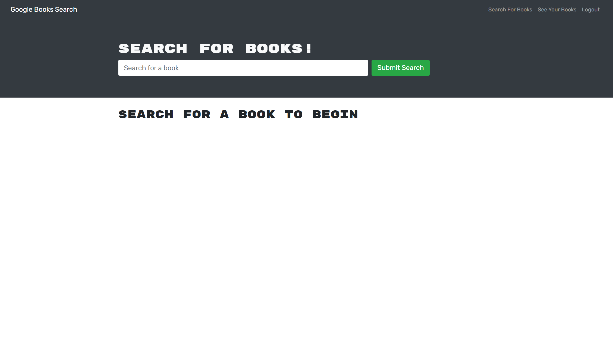

# book-search-engine 🚀
Google Book Search Engine

## Table of Contents
* [Description](#description)
* [Deployed Link](#deployed-link)
* [Installation](#installation)
* [Usage](#usage)
* [Contribution](#contribution)
* [Contact](#contact-me)

# Description

The Google Book Search Engine was created using the MERN stack! With a React front end, MongoDB database, and a Node.js & Express.js server. It's set up to allow users to save book searches to their profile and view the books along with their details. 

The application is built using Google Books API so that users can click on a link that takes them to google books! The Book Search Engine is built with GraphQL API and Apollo Server.

# Deployed Link

https://serene-citadel-56797.herokuapp.com/

# Installation

Prerequisites: [NodeJS](https://nodejs.org/en/) &amp; [MongoDB](https://www.mongodb.com/) &amp; [Express](https://expressjs.com/) &amp; [ReactJS](https://reactjs.org/)

Make sure you have MongoDB installed on your machine (if you don't, follow the instructions on the MongoDB Website). 
* Clone the repository using link below to receive all of the files.
* Run "npm install" in the command line of your terminal to set up all of the dependencies.
* Run "npm start" to start the backend and serve the client.
* Go to the url of the application (http//:localhost:3000) to begin using it.

**[Install Link](https://github.com/brian-nelson10/book-search-engine.git)**

# Usage

After installing packages, run application by using following command:
* 'npm start' 

Search for any and all books through the input box. Add your favorite books with the save books button. Check out your collection through tabs in the nav bar. 

****

****

# Contribution

Currently seeking those who can provide eyeball time, brain juice, lines of code, code improvements, raising an issue, asking a question, run the communication outside of the code repo, or even stump up some coin! Please see contact for link!! 

# Contact Me 

Want to contribute?? Drop me a line **[here](mailto:bn3l10@gmail.com)**

Check out my **[GitHub](https://github.com/brian-nelson10)**

## Maker
Made with ❤️ by brian

